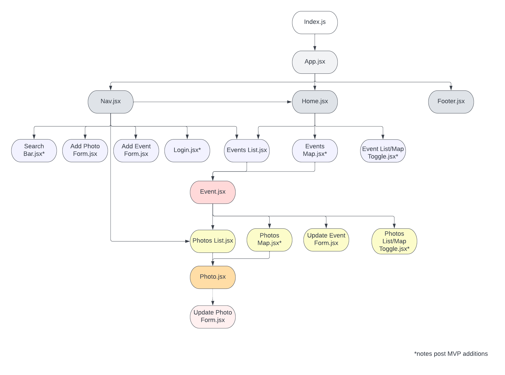
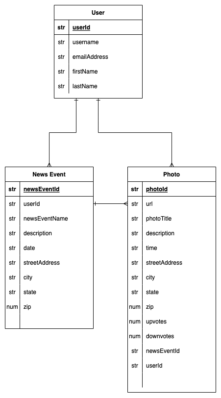

# Open Source Photo Aggregator

## Date: 10/19/2022

### By: Kalen Luciano

#### [GitHub](https://github.com/kalenluciano) | [LinkedIn](https://www.linkedin.com/in/kalen-luciano-52377b15b/)

---

### **_Description_**

This app will allow users to post timestamped and geo-located photos, making it easier for journalists and the general public to construct comprehensive timelines of news events.

The photos will be categorized by event name and users can look for photos of different events.

A post MVP version will incorporate user authentication so that only the user can update or delete their posts. There will also be a social media component in the post MVP version to discuss news events in a comments section.

---

### **_Technologies_**

-   HTML
-   CSS
-   React.js
-   Express.js
-   Node.js
-   MongoDB
-   Mongoose

**_Component Hierarchy Diagram:_**

**_Entity Relationship Diagram:_**

## 

### **_Getting Started_**

Start by going to the deployed app. Users can post a photo and document the event name, photo description, location, and timestamp. Users can update their photos with more accurate descriptions and delete any inaccurate posts.

A Trello board was used to keep track of development progress and can be viewed [here](https://trello.com/b/01B9Au6B/open-source-photo-aggregator).
