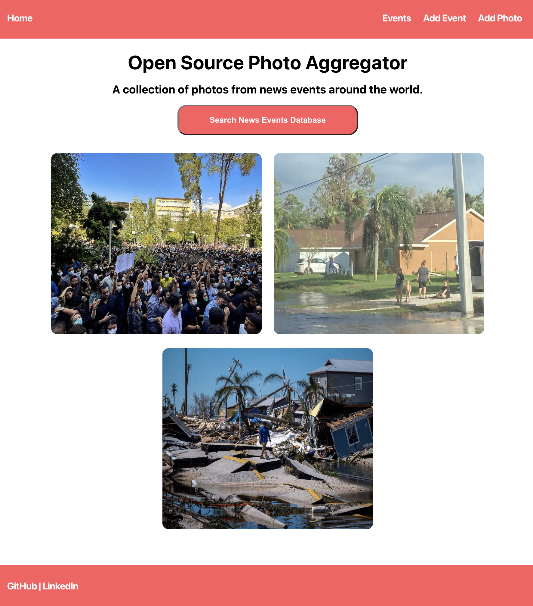
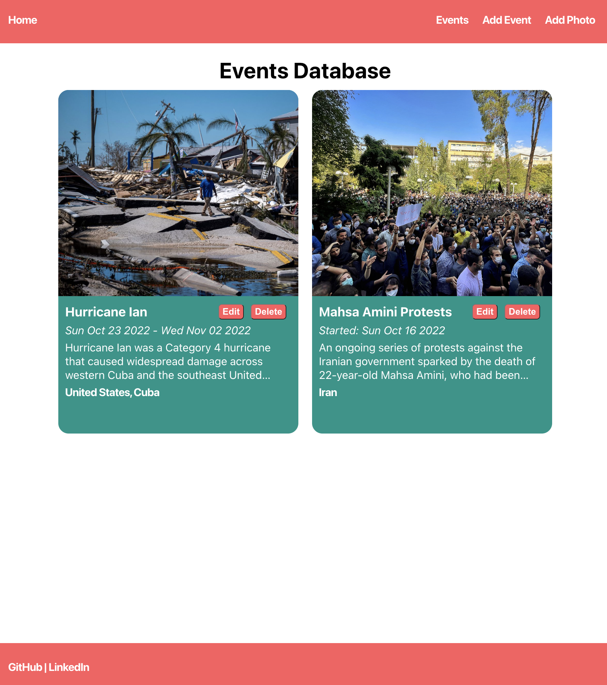
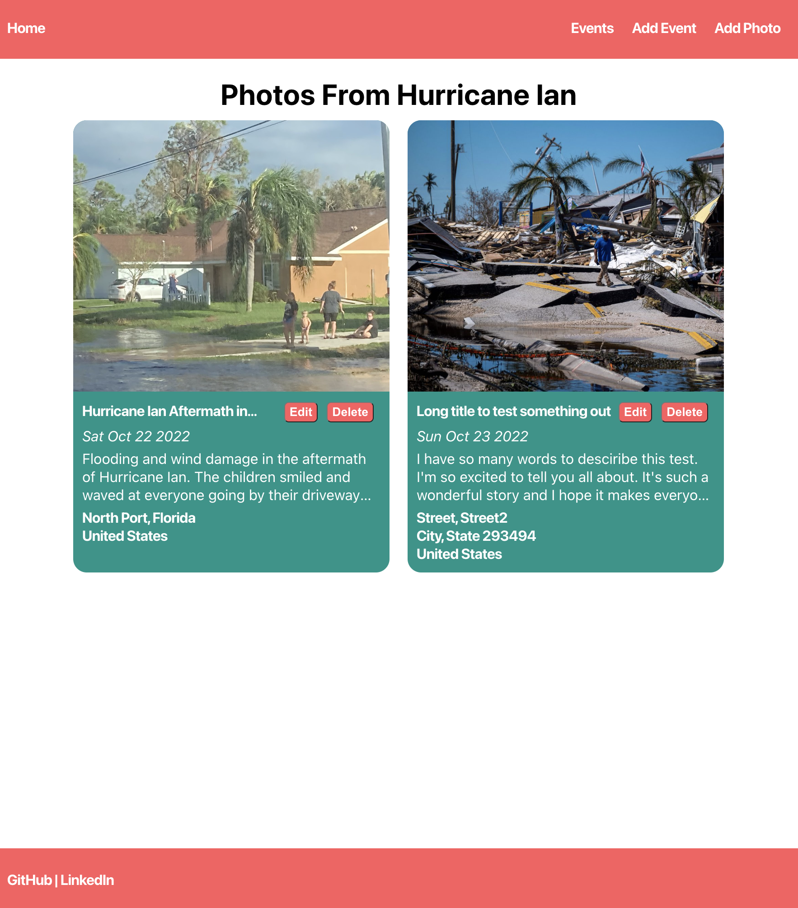
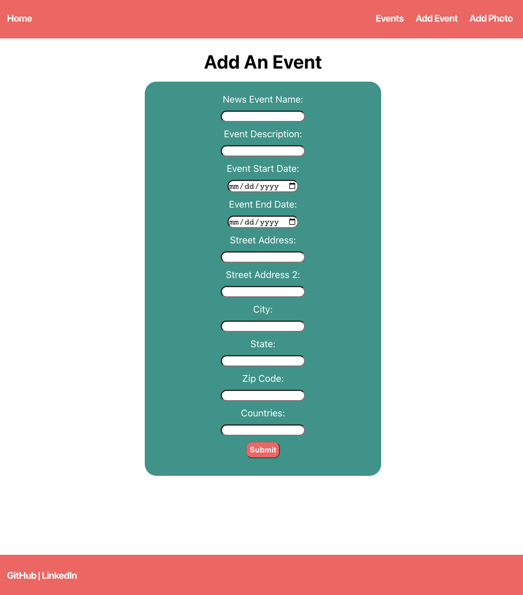

# Open Source Photo Aggregator

## Date: 10/19/2022

### By: Kalen Luciano

#### [GitHub](https://github.com/kalenluciano) | [LinkedIn](https://www.linkedin.com/in/kalen-luciano-52377b15b/)

### Deployed Site: [Open Source Photo Aggregator](https://open-source-photo-aggregator.herokuapp.com/)

---

### **_Description_**

This app will allow users to post timestamped and geo-located photos, making it easier for journalists and the general public to construct comprehensive timelines of news events.

The photos will be categorized by event name and users can look for photos of different events.

---

### **_Getting Started_**

Start by going to the deployed app [here](https://open-source-photo-aggregator.herokuapp.com/). Users can post a photo and document the event name, photo description, location, and timestamp. Users can update their photos with more accurate descriptions and delete any inaccurate posts.

---

### **_Technologies_**

-   HTML
-   CSS
-   React.js
-   Express.js
-   Node.js
-   MongoDB
-   Mongoose

**_Component Hierarchy Diagram:_**

**_Entity Relationship Diagram:_**

## 

---

### **_Screenshots_**

#### Home Page

#### Events Page

#### Photos Page

#### Form

---

### **_Future Features_**

[] Photo details page
[] Event and photo map views
[] User authentication
[] Social media features
[] Upvote and downvote button for each photo
[] Comments section to dicuss news events

---

### **_Credits_**

A Trello board was used to keep track of development progress and can be viewed [here](https://trello.com/b/01B9Au6B/open-source-photo-aggregator).
